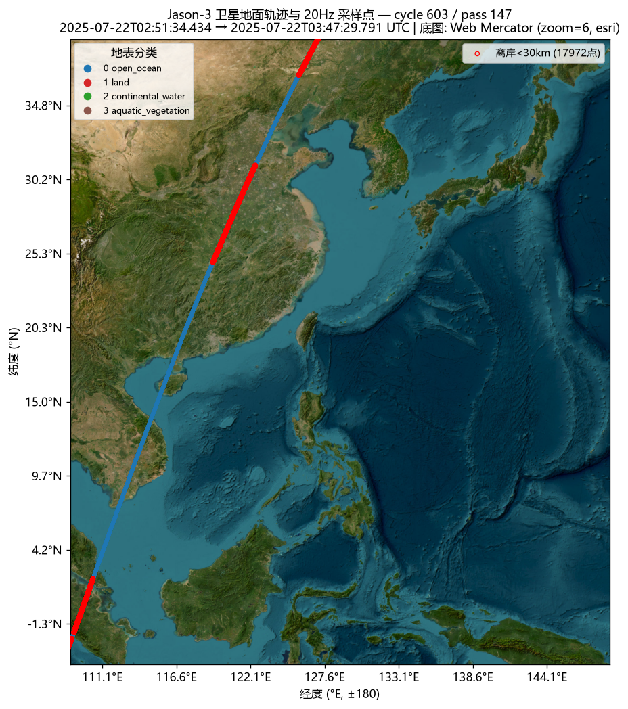
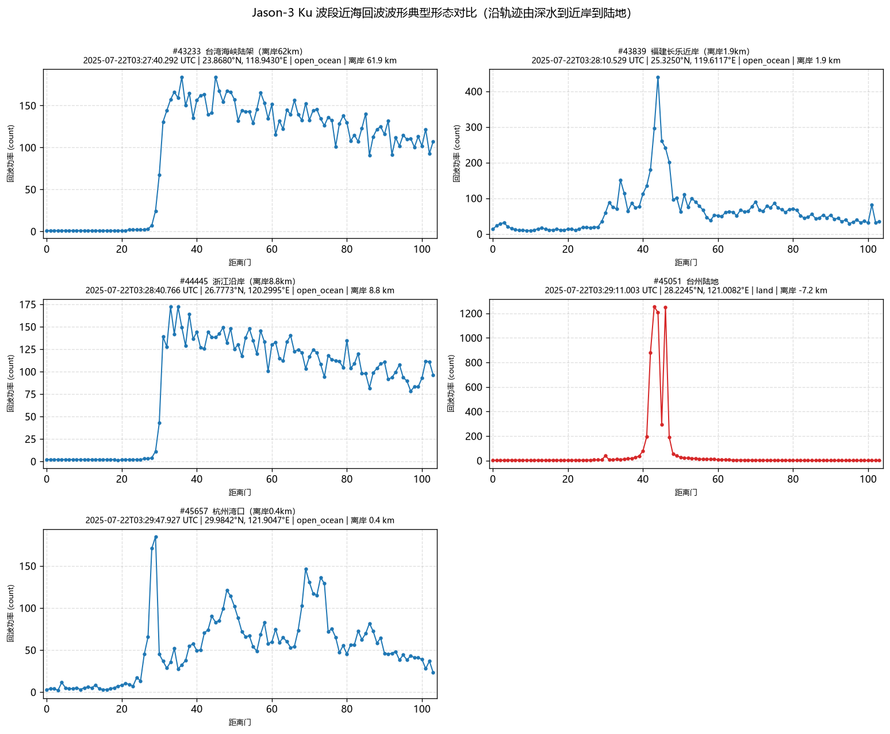

# 基于卫星雷达高度计近海回波波形仿真的海洋参数反演误差分析

Error Analysis of Ocean Parameter Inversion Based on Nearshore Echo Waveform Simulation of Satellite Radar Altimeter

毕业设计项目仓库。研究方向：以 Jason-3 卫星雷达高度计（Ku 波段）真实
SGDR-T 回波数据为基础，分析近海条件下海洋参数（海面高度/有效波高/
后向散射系数等）反演的误差特性，并结合粗糙面电磁散射仿真研究近海
回波波形的形成机理。

## 仓库结构

| 目录 | 内容 |
|---|---|
| [`Data_Reading/`](Data_Reading/) | Jason-3 SGDR-T NetCDF 数据读取、波形可视化、轨迹地图与中国近海检索工具集（Python）。详细用法见其 [README](Data_Reading/README.md) |
| [`Sea_Surface_Simulation/`](Sea_Surface_Simulation/) | 二维高斯谱随机粗糙面仿真（MATLAB，FFT 线性滤波法） |
| `参考文献/` | **不随仓库分发**（体积约 1.5 GB 且涉及版权，已在 .gitignore 中排除） |

## 环境要求

- Python ≥ 3.10：`pip install -r requirements.txt`
- MATLAB R20xx（仅 Sea_Surface_Simulation 需要）

> **Windows 中文路径提示**：本项目的数据位于含中文的目录，
> netCDF4-python 无法打开非 ASCII 路径，因此数据读取统一使用
> h5py（详见 [Data_Reading/README.md](Data_Reading/README.md) 第 3 节），
> 运行时建议设置环境变量 `PYTHONUTF8=1`。

## 数据说明

Jason-3 SGDR-T（GDR - Expertise dataset，Processing Baseline G），
CNES/EUMETSAT 发行，可从 AVISO+ (https://www.aviso.altimetry.fr/)
申请下载。本项目使用 cycle 500–513 与 600–624（2025-01 ~ 2026-02），
约 8700 个 pass 文件。**原始数据（约 200 GB）不入库**，
请自行申请后按 `Data_Reading` 中脚本的 `--root` 参数指定数据根目录。

## 快速开始

```bash
cd Data_Reading

# 读取库自检（可与 Panoply 打开同一文件逐值对照）
python jason3_reader.py <某个 JA3_GPS_2PgP*.nc 文件>

# 单点 Ku 波段 104 距离门回波波形
python plot_waveform.py <文件.nc> --mode ocean      # 自动选开阔海点
python plot_waveform.py <文件.nc> --mode coastal    # 自动选近海点

# 沿轨波形瀑布图 / 堆叠图
python plot_waveform.py <文件.nc> --heatmap --i0 43200 --i1 46000
python plot_waveform.py <文件.nc> --stack   --i0 43200 --i1 46000

# 卫星底图轨迹 + 20Hz 采样点
python plot_track.py <文件.nc> --bbox 105 145 0 42 -o track.png

# 全库扫描中国近海采样区段
python scan_nearshore.py --workers 10

# 一键复现中国近海成品图（含 cycle 603 / pass 147 闽浙沿岸示例）
python present_nearshore.py
```

## 主要成果图

近海波形演化示例（cycle 603 / pass 147，2025-07-22，福建长乐近岸
离岸 1.9 km → 浙江沿岸 → 台州陆地 → 杭州湾）：

| 图 | 内容 |
|---|---|
|  | 全弧段卫星底图轨迹与采样点 |
|  | 陆架 Brown 波形 → 近岸畸变 → 陆地尖峰 → 海湾多峰 |

全部成品图见 [`Data_Reading/output/`](Data_Reading/output/)。

## License

暂未设置（毕业设计期间保留所有权利；如需开源可后续添加 MIT 等）。
